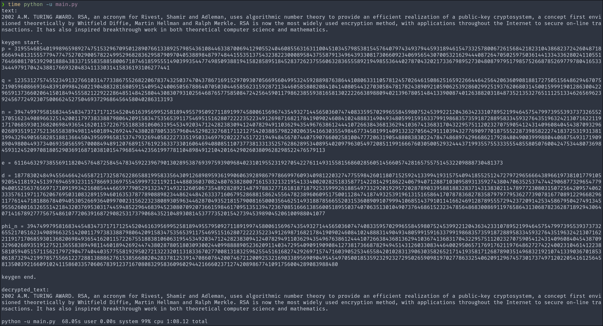
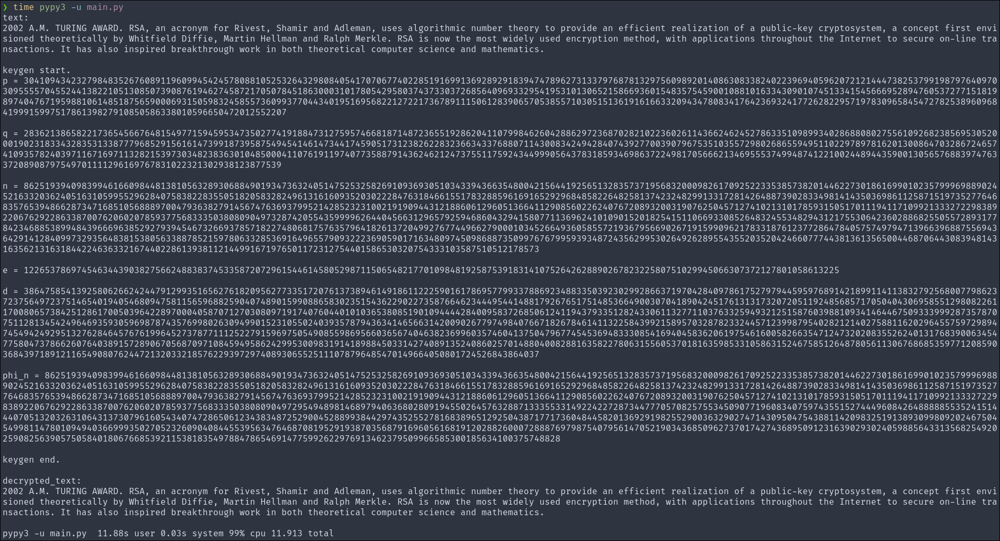

<h1 align=center>rsa 实验</h1>

## 运行截图

`p` 与 `q` 为 2048 bit 

cpython 运行



pypy 运行



密文的可读性差且数据量大, 故将密文输出至 `lab2_encripted` 文件中. 

## 实验中遇到的问题

1. python 的性能存在问题. 由于 python 自身的问题, 在进行这样的计算密集型任务时要耗费很多时间. 在尝试使用 `rsa-2048` 时基本需要花费一分钟左右. 详见截图. 解决方法除了换语言外还可以使用 pypy, pypy 有 JIT, 运算时间大幅减小了. 并且我在实现上全部采用了迭代器, 采用了惰性求值的方式提高了程序的性能. 
2. 安全问题. random 模块提供的随机数生成并不是密码学安全的. python 标准库中有密码学安全的随机数生成模块 secrets. 
3. pow 的实现. python 的数学库中自带模意义的快速幂. 将自己写的快速幂改成数学库的实现可以提升性能. 
4. 大质数的生成. sympy 库中的函数可以较高效地完成大质数的生成. 看了其源码后对自己的实现做出了一定优化. 

## 实现说明

### 明文分组

将文件按字符串读入然后再按某种映射映射成整数在机器上是不直观的. 直接将文件按照 `bytes` 读入, python 对 `bytes` 的封装十分方便, 直接对 `bytes` 进行迭代拿到的就是一个个的整数, 即每一个 bytes 的十六进制值. 我这边的实现是按照 4 bytes 一组对明文进行分组, 将 4 个整数视为 256 进制的四个数位. 不足 4 byte 的最后一组就用 0 补齐. 

### 拓展欧几里得

```python
def exgcd(a: int, b: int) -> tuple[int, int, int]:
    if b == 0:
        return a, 1, 0
    d, x, y = exgcd(b, a % b)
    return d, y, x - (a // b) * y
```

### 素数检测

```python
def _miiller_test(d, n):
    a = 2 + random.randint(1, n - 4)
    x = pow(a, d, n)

    if (x == 1 or x == n - 1):
        return True

    while (d != n - 1):
        x = (x * x) % n
        d *= 2

        if (x == 1):
            return False
        if (x == n - 1):
            return True

    return False
```
这是一轮 `miiller rabin test`, 在生成大素数的方法中进行 8 次检测使得生成的数大概率是素数. 

### 快速幂

```python
def quick_pow(a: int, b: int, m: int) -> int:
    a = a % m
    res = 1
    while b > 0:
        if (b & 1):
            res = res * a % m
        a = a * a % m
        b >>= 1
    return res
```

事实证明没有 python 自己的 `pow` 快, 因为 python 的 `pow` 也是快速幂. 
